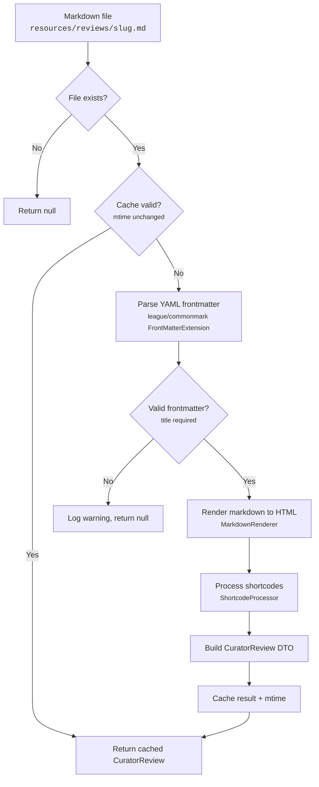
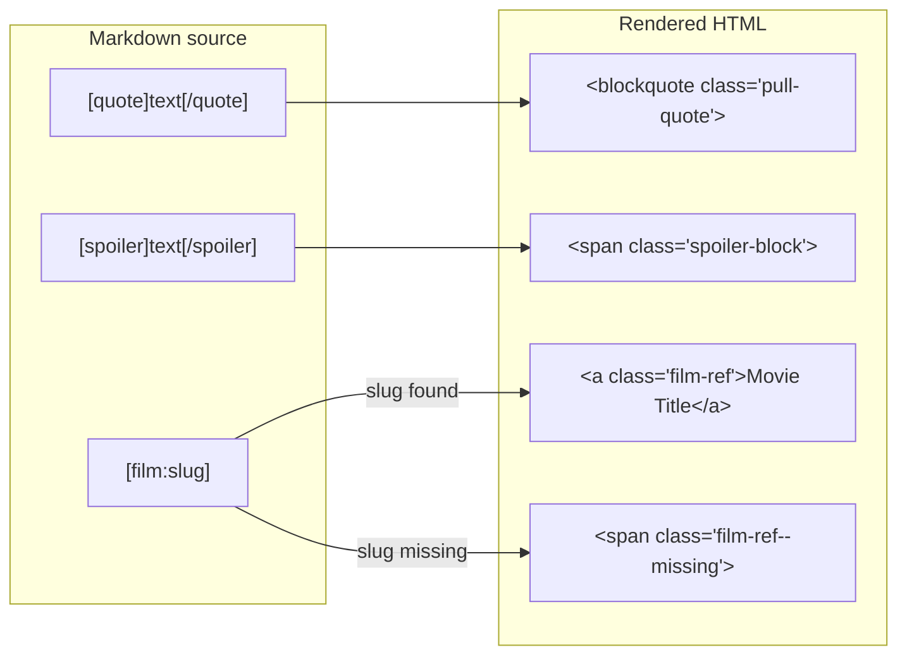
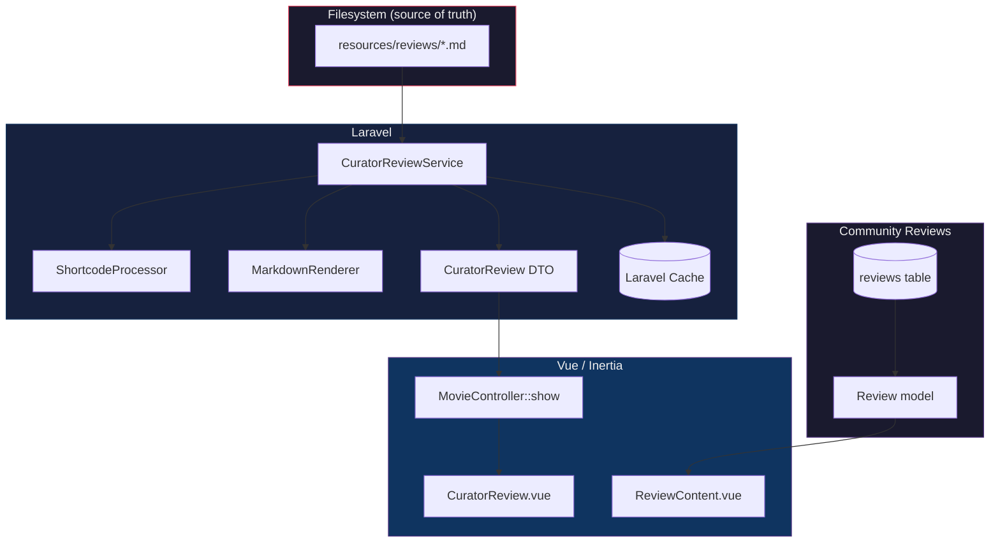

# Curator Reviews

Editorial reviews for movies-of-war.com, written as markdown files with YAML frontmatter. These are the site's authoritative reviews, separate from the database-backed community review system.

## Processing Pipeline



## Shortcodes



## Architecture



## File Format

```yaml
---
title: "Movie Title"          # required
year: 1981                     # release year
rating: 3                      # 0-4 scale, half-stars allowed
director: "Director Name"
starring: ["Actor One", "Actor Two"]
runtime: 110                   # minutes
slug: custom-slug              # optional, defaults to filename
has_spoilers: false            # optional, defaults to false
---
```

## Writing a Review

1. Create `resources/reviews/{movie-slug}.md` (slug must match the movie's slug in the database)
2. Add YAML frontmatter with at least `title`
3. Write the review body in standard markdown
4. Use `[quote]`, `[spoiler]`, and `[film:]` shortcodes as needed
5. The review appears on the movie's detail page on next request (cached after first parse)

See `CLAUDE.md` in this directory for technical details.
